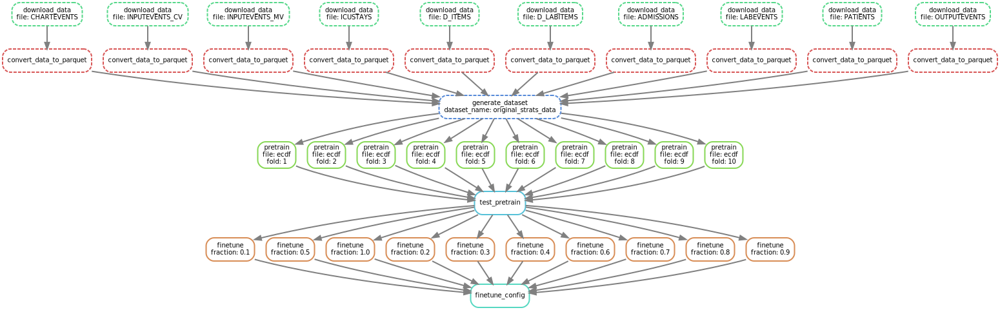

# Transformer model for Biomarkers prediction: Evaluating the impact of ECDF normalization on model robustness in clinical data

This repository contains the source code for the master's thesis. The full thesis manuscript is available [here](https://github.com/mshavliuk/thesis).

---

## Table of Contents

- [Project Setup](#project-setup)
- [Data Access](#data-access)
- [Environment Variables](#environment-variables)
- [Snakemake Profile](#snakemake-profile)
- [Executing Tests (Optional)](#executing-tests-optional)
- [Running the Experiments](#running-the-experiments)
  - [With Snakemake](#with-snakemake)
  - [With Bash Commands](#with-bash-commands)

---

## Project Setup

<details>
<summary>TL;DR with defaults</summary>
<div>

    git clone https://github.com/mshavliuk/thesis_code.git ecdf_thesis
    cd ecdf_thesis
    
    conda env create -f workflow/envs/gcloud.yml -n gcloud
    conda activate gcloud
    gcloud auth login
    gcloud config set project $(gcloud projects list --format="value(projectId)" --limit=1)
    conda deactivate
    
    conda env create -f environment.yml -n ecdf_thesis
    
    mkdir /tmp/ecdf_thesis

    conda env config vars set \
      PYTHONPATH=$(pwd) \
      DATA_DIR=$(pwd)/data \
      WANDB_PROJECT=ECDF-thesis \
      TEMP_DIR=$(pwd)/temp \
      SNAKEMAKE_PROFILE=$(pwd)/workflow/profiles/workstation \
      -n ecdf_thesis

    conda activate ecdf_thesis
    
    wandb login
    
    snakemake generate_unittest_dataset
    pytest

    snakemake
</div>
</details> 


To get started, clone the repository and set up the environment:

```bash
git clone https://github.com/mshavliuk/thesis_code.git ecdf_thesis
cd ecdf_thesis

# Create and activate the Conda environment
conda env create -f environment.yml -n ecdf_thesis
conda activate ecdf_thesis

# Log in to Weights & Biases for checkpointing and logging
wandb login
```

### Alternative: explicit install

Perhaps, less developer-friendly, but more reproducible approach to install project dependencies is to try to obtain the exact versions that were installed during the project development (ignoring all patch-level updates). It's generally not recommended to use this approach unless the first one breaks.

```bash
conda create -f environment.txt -n ecdf_thesis
conda activate ecdf_thesis
pip install -r requirements.txt
```

---

## Data Access

The **MIMIC-III dataset** is distributed under restricted access by PhysioNet. To obtain the dataset, you must complete additional certification. Refer to the [MIMIC-III dataset page](https://physionet.org/content/mimiciii/1.4/) for more information.

To download the dataset via Google Cloud:

1. Connect your PhysioNet account to Google Cloud in [Cloud Settings](https://physionet.org/settings/cloud/).
2. [Request Google Cloud access](https://physionet.org/projects/mimiciv/1.0/request_access/3).
3. Set up a Google Cloud Project and configure a [billing account](https://cloud.google.com/billing/docs/how-to/manage-billing-account).
4. Create a designated Conda environment with Google Cloud SDK:
   ```bash
   conda env create -f workflow/envs/gcloud.yml -n gcloud
   conda activate gcloud
   ```
   The reason for a separate environment is that at this time (20.11.24) [google-cloud-sdk](https://anaconda.org/conda-forge/google-cloud-sdk) is incompatible with Python 3.12 used in this project.
5. Authenticate using the following commands:
   ```bash
   gcloud auth login
   ```
6. Set proper PROJECT_ID or keep the default one
   ```
   # see available projects
   gcloud projects list
   
   # choose the default project to use
   gcloud config set project PROJECT_ID
   ```
7. Get back to the main Conda environment
   ```bash
   conda activate ecdf_thesis
   ```

---

## Environment Variables

Set the following environment variables to ensure proper functionality:

- `PYTHONPATH`: Include the root project directory.
- `TEMP_DIR`: Path for temporary files, has to lead to **existing** directory (e.g., `$(pwd)/temp`).
- `DATA_DIR`: Path for datasets and plots.

On clusters with restricted filesystem access, you may also need to set:

- `MPLCONFIGDIR`: `/tmp/ecdf_thesis/matplotlib`
- `SNAKEMAKE_OUTPUT_CACHE`: `/tmp/ecdf_thesis/snakemake-cache`
- `XDG_CACHE_HOME`: `/tmp/ecdf_thesis/xdg_cache`

To persist these variables in the current Conda environment:

```bash
mkdir temp

conda env config vars set \
  PYTHONPATH=$(pwd) \
  DATA_DIR=$(pwd)/data \
  WANDB_PROJECT=ECDF-thesis \
  TEMP_DIR=$(pwd)/temp

# reactivate the environment for changes to take effect
conda deactivate
conda activate ecdf_thesis
```

---


## Snakemake Profile

It is recommended to configure a **Snakemake profile** suited to your hardware. This project includes two profiles:

1. [`workstation`](workflow/profiles/workstation/config.yaml): For local workstations with a single GPU.
2. [`tuni-cluster`](workflow/profiles/tuni-cluster/config.yaml): For Slurm clusters with a quota of 12 nodes.

To set the profile:

```bash
# For local usage
conda env config vars set SNAKEMAKE_PROFILE=$(pwd)/workflow/profiles/workstation

# For Slurm clusters
conda env config vars set SNAKEMAKE_PROFILE=$(pwd)/workflow/profiles/tuni-cluster

# Reactivate the environment
conda deactivate
conda activate ecdf_thesis
```

For more details, refer to the [Snakemake documentation](https://snakemake.readthedocs.io/en/latest/executing/cli.html#profiles).

---

## Executing Tests (Optional)

To ensure the code and dependencies are properly set up, run unit tests:

1. Preprocess datasets for unit testing:
   ```bash
   snakemake generate_unittest_dataset
   ```

2. Run the tests:
   ```bash
   pytest
   ```

 <details>
  <summary>Expected output</summary>
  <pre>========================================== test session starts ===========================================
platform linux -- Python 3.12.7, pytest-8.3.3, pluggy-1.5.0
rootdir: /home/user/projects/thesis_code
collected 58 items                                                                                       

src/util/tests/test_collator.py .....                                                              [  8%]
src/util/tests/test_dataset.py ..................                                                  [ 39%]
src/util/tests/test_variable_ecdf_scaler.py ......                                                 [ 50%]
workflow/tests/test_data_extractor.py ....................                                         [ 84%]
workflow/tests/test_data_processing_job.py .........                                               [100%]

==================================== 58 passed, 11 warnings in 24.63s ====================================

</pre>
</details>

---

## Running the Experiments

### Steps to Run

1. Download the MIMIC-III dataset from Google Cloud and store temporarily.
2. Convert downloaded `.csv.gz` files to `.parquet`.
3. Preprocess data to generate datasets with different noise levels (listed in [`config.yaml`](workflow/config.yaml)).
4. Pretrain the model.
5. Compute test metrics for pretrained models and mark the best ones for finetuning.
6. Fine-tune the model.
7. Analyze the results

Adjust the number of cross-validation folds and data fractions in [`config.yaml`](workflow/config.yaml).

---

### With Snakemake

Snakemake automates the entire experiment pipeline (except the analysis). To reproduce the experiments, simply run:

```bash
snakemake
```

The computation may take several days, depending on hardware.

Alternatively, you can run specific experiments. For example, to execute all jobs for the ECDF experiments:

```bash
snakemake results/finetune_config/ecdf.SUCCESS
```

The Snakemake DAG for this pipeline:

<picture>
  <source media="(prefers-color-scheme: dark)" srcset="./images/ecdf_workflow_dag_dark.svg">
  <source media="(prefers-color-scheme: light)" srcset="./images/ecdf_workflow_dag_light.svg">
  
</picture>


After completion, Snakemake creates empty `.SUCCESS` files in `results/job_type/job_name.SUCCESS` to track completed jobs. This ensures that subsequent runs do not re-execute unless input files or configurations are modified.

---

### With Bash Commands

For more flexibility, you can run individual experiments or steps directly using Bash commands. For example, to run model pretraining:

```bash
python src/pretrain --config experiments/pretrain/ours-noise-13.yaml
```

Refer to the `shell` sections in [`Snakefile`](workflow/Snakefile) for more examples.
